# Perona-Malik with PyTorch and CNNs

Perona-Malik diffusion is a well known regularization technique that preserves edges. Although we normally use a constant kernel to calculate the gradients (i.e. an edge detector such as Laplacian), using CNNs and PyTorch, it is possible to explore operators other than edge detectors. When combined with an appropriate loss function and the right diffusion rate vs learning rate, this allows exploring aesthetically pleasing diffusion reaction transformations which still temporarily preserve edges to some extent. Feel free to see my [blog](https://gozepolat.github.io/posts/Art_with_math/) for more details.

## Usage

Just run `python demo.py --image <path/to/image> --out-folder <optional/path/to/save/folder>`! For camera input, try `demo_video.py` after making sure that you have GPU acceleration enabled and `opencv` installed.

### Example

`python demo.py --image images/star.jpg --out-folder transformations` will create transformed versions of the image `star.jpg` and save them in the output folder `transformations`.

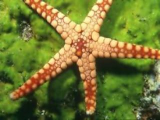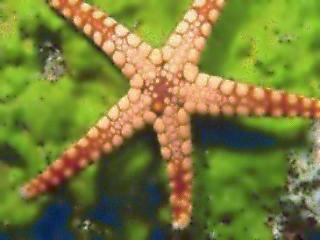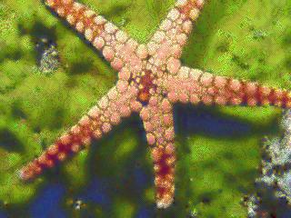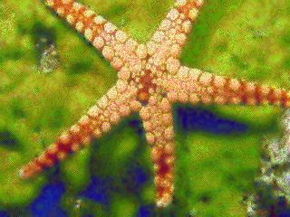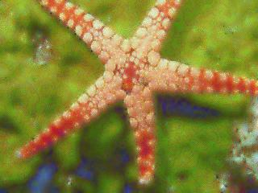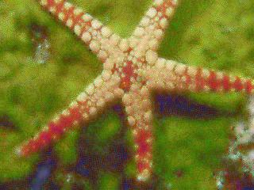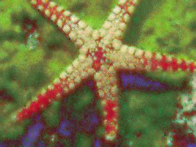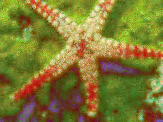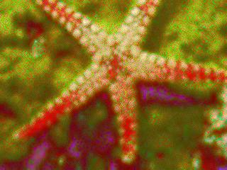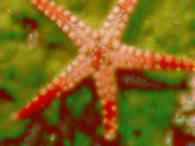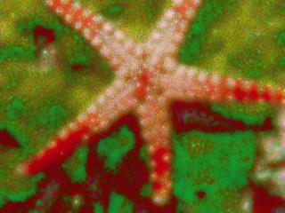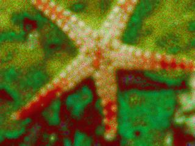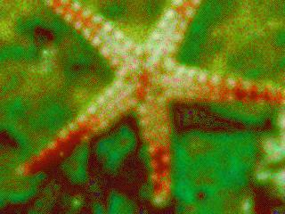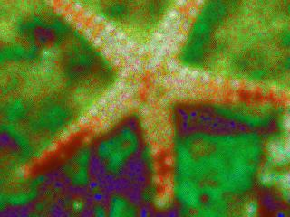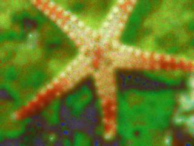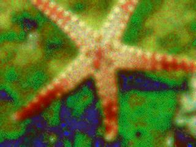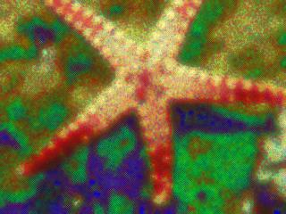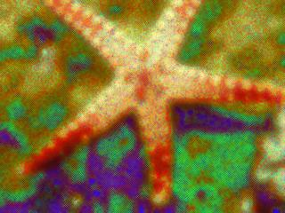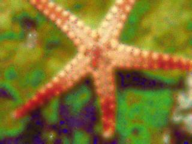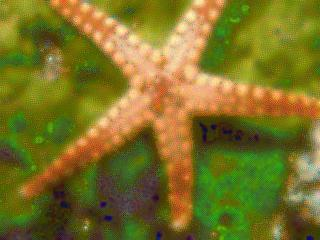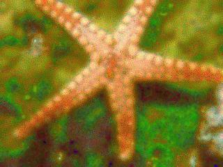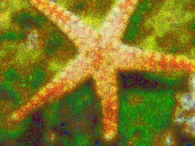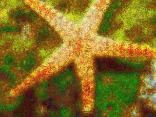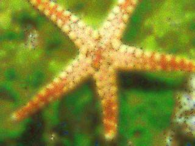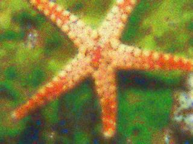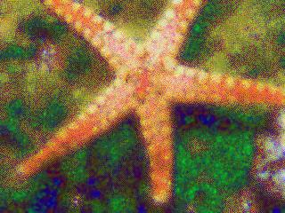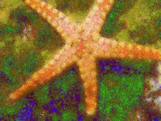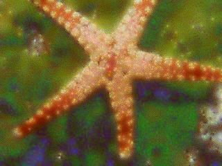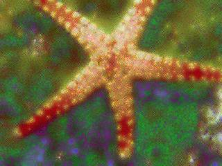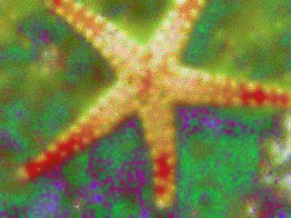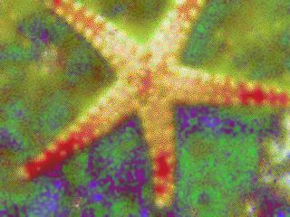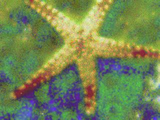

#### Sample Video
[profile.webm](https://github.com/gozepolat/fast-perona-malik/assets/25344752/5191e484-b693-4a8a-af07-6974191afe02)

